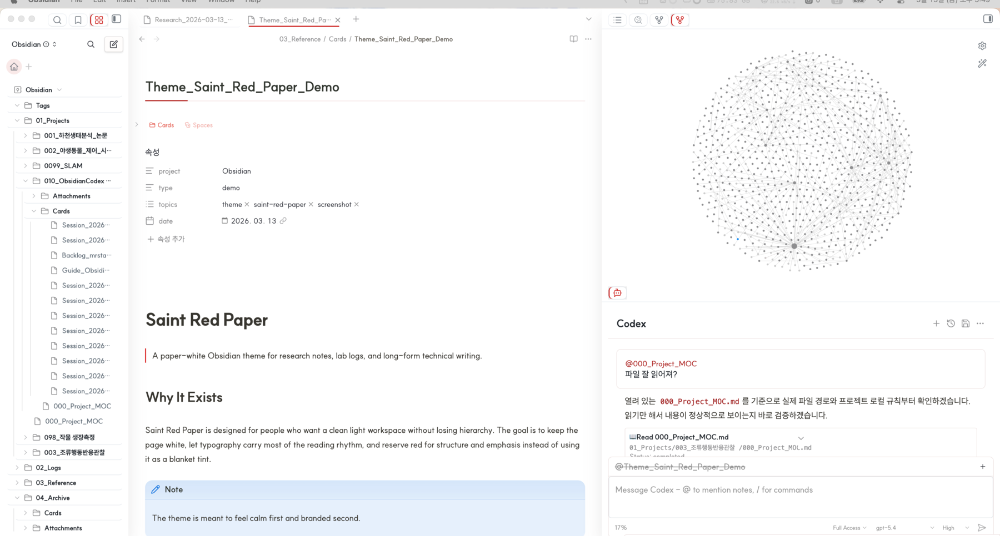

# Saint Red Paper

Saint Red Paper is a paper-white Obsidian theme for research notes, lab logs, and long-form technical writing. It stays bright and quiet by default, uses red only where structure needs emphasis, and folds the main sidebar, callout, tab, and typography refinements into the theme itself instead of depending on a pile of snippets.



## Preview

| Workspace | Reading surface |
| --- | --- |
|  |  |

The preview assets above are live captures from the bundled demo note in Obsidian.

## What It Changes

- Keeps the main canvas close to white paper instead of tinting the whole workspace
- Tunes headings, spacing, blockquotes, and callouts for reading-heavy notes
- Gives sidebars, root tabs, links, tags, and notices a restrained red-paper language
- Includes built-in `Style Settings` hooks for width, rules, sidebar accents, links, tags, and table density
- Still behaves predictably even if `Style Settings` is not installed
- Ships as a compact theme package with `theme.css` and `manifest.json`

## Quick Install

Requires Obsidian `1.1.9` or later.

### Manual

1. Copy this folder into your vault's `.obsidian/themes/Saint Red Paper/` directory.
2. Open `Settings -> Appearance -> Themes`.
3. Select `Saint Red Paper`.

### Git clone

```bash
git clone https://github.com/saint0721/saint-red-paper.git "Saint Red Paper"
```

Then move or symlink the folder into `.obsidian/themes/Saint Red Paper/`.

### Optional plugin

The theme works without extra plugins, but `Style Settings` is recommended if you want to adjust the exposed theme variables from the UI instead of editing CSS.

## Best Fit

Saint Red Paper is designed for:

- research notes
- lab notebooks
- proposal drafts
- long-form technical writing
- clean light-mode daily knowledge work

It is a weaker fit for dashboard-heavy, card-heavy, or heavily gamified workspace styles.

## Recommended setup

- Font: `SUIT`
- Interface mode: Light
- Accent color: `#cd2623` if you want the OS-level accent to sit close to the theme palette
- Snippets: Disable older overlapping table/sidebar snippets once this theme is enabled

## Exposed Style Settings controls

- Note width
- Paragraph width
- Inline title rule width
- H1 rule width
- Sidebar active accent
- Sidebar active background
- Sidebar edge shadow opacity
- Link color
- Link hover color
- Tag shape
- Table vertical padding
- Table outer border color

## Before You Publish

If you plan to share the theme publicly, verify:

- Reading View and Live Preview both look correct
- Dataview tables do not reintroduce conflicting backgrounds
- No legacy snippets are still overriding table or sidebar styles
- `Style Settings` controls remain optional rather than required
- The current Obsidian version still respects the selectors used in `theme.css`

## Included Files

- `theme.css`: Theme source
- `manifest.json`: Obsidian theme manifest
- `assets/saint-red-paper-hero.png`: Main live workspace hero image
- `assets/saint-red-paper-cover.svg`: Repo preview graphic
- `assets/saint-red-paper-workspace.png`: Live Obsidian workspace preview
- `assets/saint-red-paper-reading.png`: Live reading surface preview
- `CHANGELOG.md`: Release notes

## Links

- Homepage: https://github.com/saint0721/saint-red-paper
- Issues: https://github.com/saint0721/saint-red-paper/issues

For release history, see [CHANGELOG.md](CHANGELOG.md).
