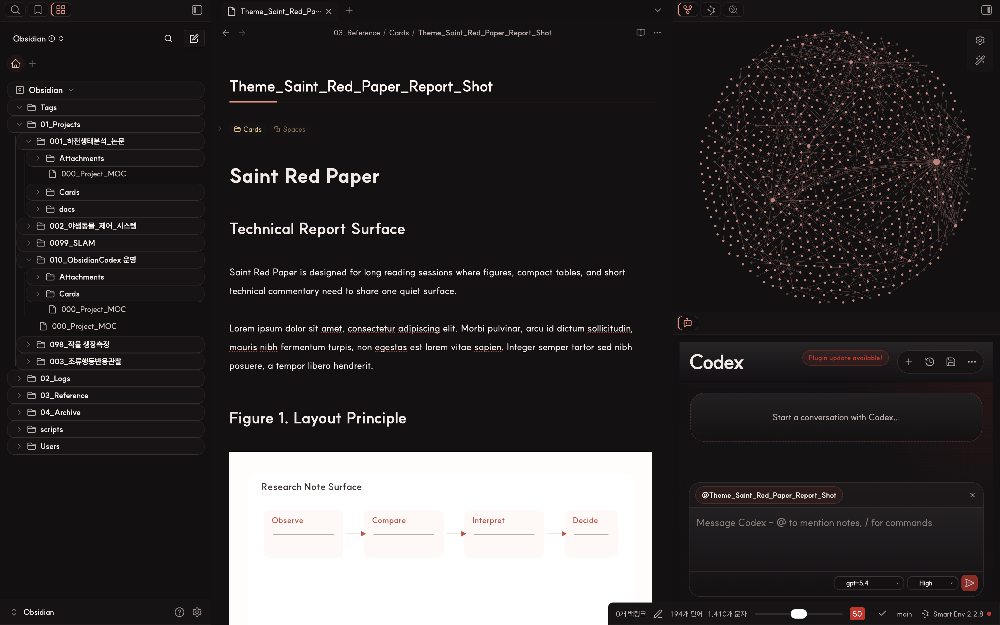
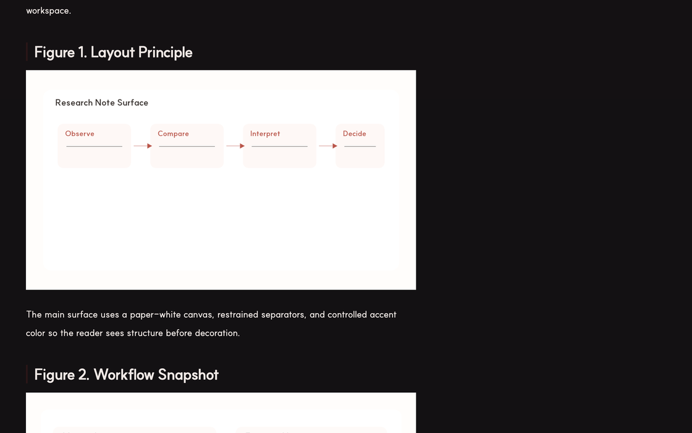

# Saint Red Paper

Saint Red Paper is a light-first Obsidian theme for research notes, lab logs, and long-form technical writing. It keeps light mode as the primary visual identity, but now also includes a matching dark mode so the same note structures remain usable when the workspace switches to dark.




## Preview

| Main workspace | Main workspace dark |
| --- | --- |
|  |  |

| Light workspace | Dark workspace |
| --- | --- |
|  |  |

The preview assets above are real captures from live Obsidian notes and panels. The first row shows the main light and dark workspace setup with the same graph and `Agent Client` arrangement. The second row keeps the focus on the actual note surface in light and dark mode.

## Community Theme Metadata

If you want to submit Saint Red Paper to the official Obsidian community theme list, the current ready-to-paste metadata is:

```json
{
  "name": "Saint Red Paper",
  "author": "saintkim",
  "repo": "saint0721/saint-red-paper",
  "screenshot": "assets/saint-red-paper-community.png",
  "modes": ["dark", "light"]
}
```

Notes:

- `modes` is declared as `["dark", "light"]`, but Saint Red Paper is still intentionally positioned as a light-first theme.
- `publish` is omitted for now because Obsidian Publish support has not been explicitly validated yet.
- The community screenshot asset is a real 16:9 capture prepared for submission review.

## What It Changes

- Keeps the main canvas close to white paper instead of tinting the whole workspace
- Tunes headings, spacing, blockquotes, callouts, and inline code for reading-heavy notes
- Gives sidebars, root tabs, links, tags, and notices a restrained red-paper language
- Adds a paper-like treatment for Dataview result tables so they feel closer to notes than widgets
- Extends the same visual language into a matching dark mode instead of leaving dark as a token-only fallback
- Adds a compact optional styling layer for `Agent Client` controls when that plugin is installed
- Includes built-in `Style Settings` hooks for width, rules, sidebar accents, links, tags, and table density
- Still behaves predictably even if `Style Settings` is not installed
- Ships as a compact theme package with `theme.css` and `manifest.json`

## Quick Install

Requires Obsidian `1.1.9` or later.

### Manual

1. Copy this folder into your vault's `.obsidian/themes/Saint Red Paper/` directory.
2. Open `Settings -> Appearance -> Themes`.
3. Select `Saint Red Paper`.

### Git clone

```bash
git clone https://github.com/saint0721/saint-red-paper.git "Saint Red Paper"
```

Then move or symlink the folder into `.obsidian/themes/Saint Red Paper/`.

### Optional plugin

The theme works without extra plugins, but these companion plugins are recommended if you want the same setup shown in the previews:

- `Style Settings` for adjusting exposed theme variables from the UI
- `Dataview` if you want result tables like the ones shown in the demo captures
- `Agent Client` if you want the matching chat workflow shown in the hero preview

### Optional plugin-specific styling

Saint Red Paper can also style some third-party plugin surfaces if they already exist in the user's vault. In practice, `Agent Client` is the main companion plugin currently styled by the theme, and the screenshots intentionally show that integration because it fits the research-note workflow the theme is built around.

Important:

- The theme does **not** bundle `Agent Client` or any other plugin functionality.
- Users still need to install those plugins separately.
- What the theme can provide is visual integration, not plugin features.

## Best Fit

Saint Red Paper is designed for:

- research notes
- lab notebooks
- proposal drafts
- long-form technical writing
- clean light-mode daily knowledge work

It is a weaker fit for dashboard-heavy, card-heavy, or heavily gamified workspace styles.

## Recommended setup

- Font: `SUIT`
- Interface mode: Light
- Accent color: `#cd2623` if you want the OS-level accent to sit close to the theme palette
- Snippets: Disable older overlapping table/sidebar snippets once this theme is enabled

## Exposed Style Settings controls

- Note width
- Paragraph width
- Inline title rule width
- H1 rule width
- Sidebar active accent
- Sidebar active background
- Sidebar edge shadow opacity
- Link color
- Link hover color
- Tag shape
- Table vertical padding
- Table outer border color

## Before You Publish

If you plan to share the theme publicly, verify:

- Reading View and Live Preview both look correct
- Dataview tables do not reintroduce conflicting backgrounds
- No legacy snippets are still overriding table or sidebar styles
- `Style Settings` controls remain optional rather than required
- The current Obsidian version still respects the selectors used in `theme.css`
- Optional plugin-specific styling degrades safely when the target plugin is not installed

## Included Files

- `theme.css`: Theme source
- `manifest.json`: Obsidian theme manifest
- `assets/saint-red-paper-hero.png`: Main live workspace capture
- `assets/saint-red-paper-hero-dark.png`: Main live dark workspace capture
- `assets/saint-red-paper-community.png`: 16:9 community submission screenshot
- `assets/saint-red-paper-workspace.png`: Live light-mode workspace preview
- `assets/saint-red-paper-dark.png`: Live dark-mode reading preview
- `CHANGELOG.md`: Release notes

## Links

- Homepage: https://github.com/saint0721/saint-red-paper
- Issues: https://github.com/saint0721/saint-red-paper/issues

For release history, see [CHANGELOG.md](CHANGELOG.md).
