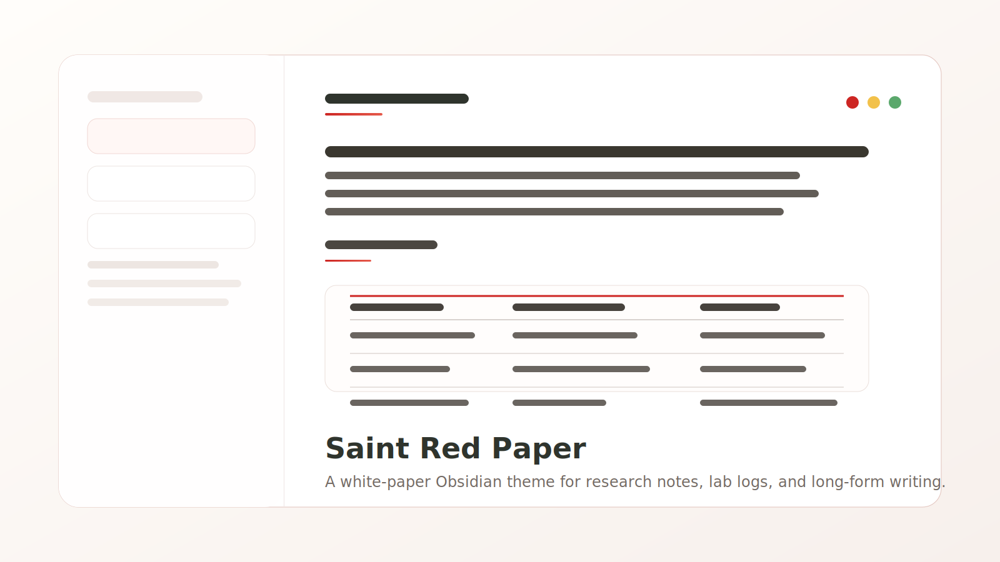
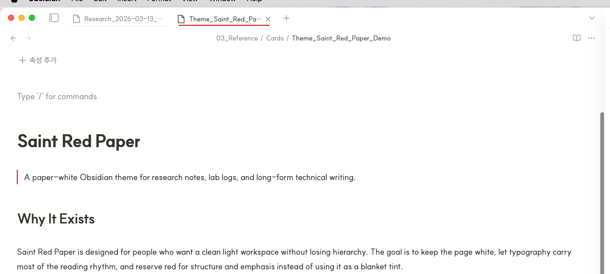
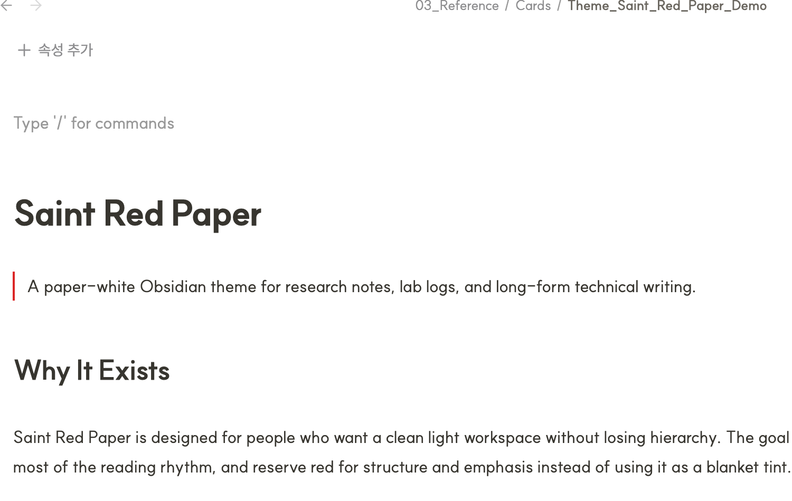

# Saint Red Paper

Saint Red Paper is a light-first Obsidian theme for research notes, lab logs, and long-form writing. It keeps the workspace close to white paper, uses restrained red accents for hierarchy, and bundles the sidebar, callout, tab, and typography refinements directly into the theme instead of relying on a stack of snippets.



## Preview

| Workspace | Reading surface |
| --- | --- |
|  |  |

The preview assets above are captured from a live Obsidian workspace using the bundled theme.

## Highlights

- Paper-white light theme with controlled red accents instead of full-surface tinting
- Research-note typography tuned for long reading sessions
- Refined root tabs, notices, sidebars, links, tags, blockquotes, and callouts
- Built-in `Style Settings` support for note width, paragraph width, title rules, sidebar accent, link color, tag shape, and table density controls
- Sensible defaults even without the `Style Settings` plugin enabled
- Single-file runtime footprint: `theme.css` + `manifest.json`

## Install

### Manual

1. Copy this folder into your vault's `.obsidian/themes/` directory.
2. Open `Settings -> Appearance -> Themes`.
3. Select `Saint Red Paper`.

### Git clone

```bash
git clone https://github.com/saint0721/saint-red-paper.git "Saint Red Paper"
```

Then move or symlink the folder into `.obsidian/themes/`.

### Recommended companion plugin

The theme works without extra plugins, but `Style Settings` is recommended if you want to adjust the exposed theme variables from the UI instead of editing CSS.

## Best fit

Saint Red Paper is designed for:

- research notes
- lab notebooks
- proposal drafts
- long-form technical writing
- clean light-mode daily knowledge work

It is less opinionated about dashboards and highly decorative card-heavy layouts.

## Recommended setup

- Font: `SUIT`
- Interface mode: Light
- Accent color: `#cd2623` or let the theme handle its own component accents
- Snippets: Disable older overlapping table/sidebar snippets once this theme is enabled

## Exposed Style Settings controls

- Note width
- Paragraph width
- Inline title rule width
- H1 rule width
- Sidebar active accent
- Sidebar active background
- Sidebar edge shadow opacity
- Link color
- Link hover color
- Tag shape
- Table vertical padding
- Table outer border color

## Validation checklist

Before publishing a release, verify:

- Reading View and Live Preview both look correct
- Dataview tables do not reintroduce conflicting backgrounds
- No legacy snippets are still overriding table or sidebar styles
- `Style Settings` controls remain optional rather than required
- The current Obsidian version still respects the selectors used in `theme.css`

## Repository layout

- `theme.css`: Theme source
- `manifest.json`: Obsidian theme manifest
- `assets/saint-red-paper-cover.svg`: Repo preview graphic
- `assets/saint-red-paper-workspace.png`: Live Obsidian workspace preview
- `assets/saint-red-paper-reading.png`: Live reading surface preview
- `CHANGELOG.md`: Release notes

## Repository

- Homepage: https://github.com/saint0721/saint-red-paper
- Issues: https://github.com/saint0721/saint-red-paper/issues

## Release notes

See [CHANGELOG.md](CHANGELOG.md).

## Public submission notes

- The repository now includes live Obsidian screenshots for README previews. Capture both Reading View and Live Preview before submitting the theme to a public gallery.
- Test both Reading View and Live Preview on the notes you use most often, especially Dataview-heavy notes and long tables.
