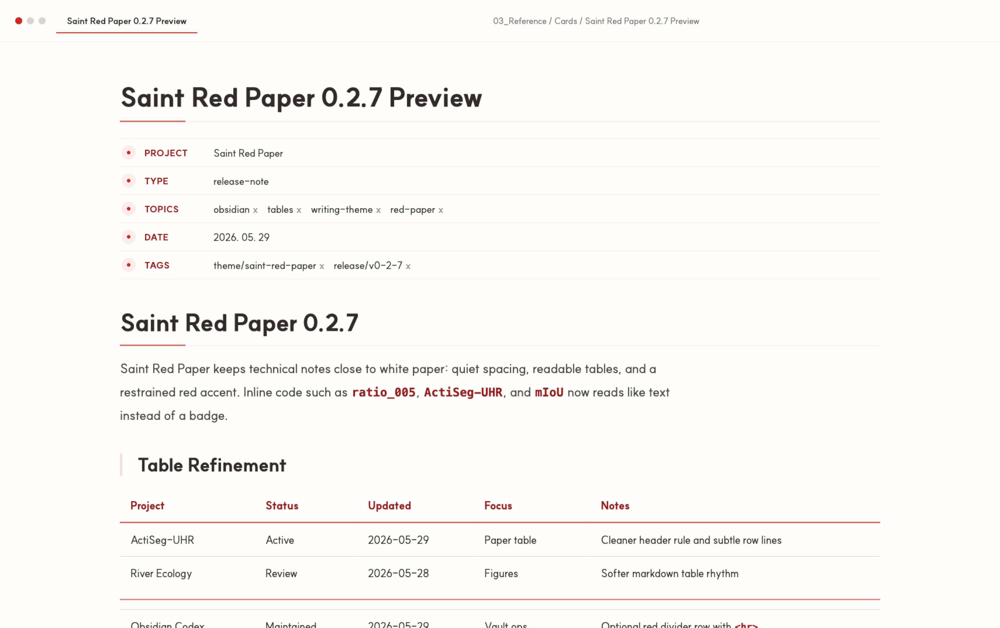
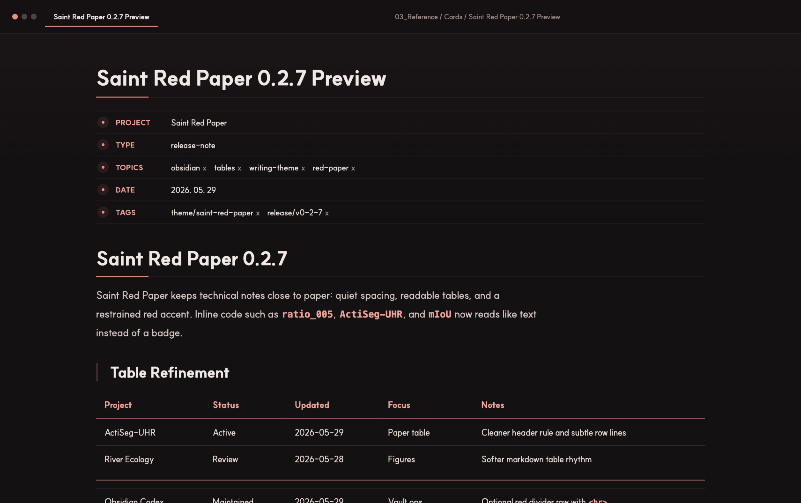

# Saint Red Paper

Saint Red Paper is a light-first Obsidian theme for research notes, lab logs, and long-form technical writing. It keeps light mode as the primary visual identity, but now also includes a matching dark mode so the same note structures remain usable when the workspace switches to dark.

<div align="center">

<a href="https://community.obsidian.md/themes/saint-red-paper">Obsidian Community Theme</a> · <a href="https://github.com/saint0721/saint-red-paper/stargazers">Star on GitHub</a> · <a href="https://github.com/saint0721/saint-red-paper/issues">Issues</a>

[](https://community.obsidian.md/themes/saint-red-paper)
[](https://github.com/saint0721/saint-red-paper/stargazers)

<strong>If Saint Red Paper fits your workflow, please star the repo.</strong>

</div>



Saint Red Paper is available in the official Obsidian Community directory. Feedback, bug reports, and workspace screenshots are always welcome in [Issues](https://github.com/saint0721/saint-red-paper/issues).

## What It Changes

- Keeps the main canvas close to white paper instead of tinting the whole workspace
- Tunes headings, spacing, blockquotes, callouts, and inline code for reading-heavy notes
- Gives sidebars, root tabs, links, tags, and notices a restrained red-paper language
- Adds a paper-like treatment for Markdown and Dataview tables so they feel closer to notes than widgets
- Supports optional red table dividers with a simple `<hr>` marker row
- Extends the same visual language into a matching dark mode instead of leaving dark as a token-only fallback
- Adds a compact optional styling layer for `Agent Client` controls when that plugin is installed
- Fits well with `make.md`'s `Navigator` panel if you want the workspace captures to feel closer to the author's setup
- Includes built-in `Style Settings` hooks for width, rules, sidebar accents, links, tags, and table density
- Still behaves predictably even if `Style Settings` is not installed
- Installs from the standard Obsidian theme files, `theme.css` and `manifest.json`

## Quick Install

Requires Obsidian `1.1.9` or later.

### Obsidian Community Themes

1. Open `Settings -> Appearance -> Themes -> Manage`.
2. Search for `Saint Red Paper`.
3. Install and select the theme.

### Manual

1. Copy this folder into your vault's `.obsidian/themes/Saint Red Paper/` directory.
2. Open `Settings -> Appearance -> Themes`.
3. Select `Saint Red Paper`.

### Git clone

```bash
git clone https://github.com/saint0721/saint-red-paper.git "Saint Red Paper"
```

Then move or symlink the folder into `.obsidian/themes/Saint Red Paper/`.

### Optional plugins

The theme works without extra plugins. These plugins are only recommended if you want a setup closer to the screenshots:

- `Style Settings` for adjusting exposed theme variables from the UI
- `Dataview` if you want result tables like the ones shown in the demo captures
- `Agent Client` if you want matching visual treatment for chat controls
- `make.md` if you want the `Navigator` panel layout shown in the author's workspace

### Optional plugin-specific styling

Saint Red Paper can style a few third-party plugin surfaces when those plugins already exist in the user's vault. The theme does not bundle plugin functionality; it only provides visual integration where safe.

Important:

- The theme does **not** bundle `Agent Client` or any other plugin functionality.
- Users still need to install those plugins separately.
- What the theme can provide is visual integration, not plugin features.

## Best Fit

Saint Red Paper is designed for:

- research notes
- lab notebooks
- proposal drafts
- long-form technical writing
- clean light-mode daily knowledge work

It is a weaker fit for dashboard-heavy, card-heavy, or heavily gamified workspace styles.

## Recommended setup

- Font: `SUIT`
- Interface mode: Light
- Accent color: `#cd2623` if you want the OS-level accent to sit close to the theme palette
- Snippets: Disable older overlapping table/sidebar snippets once this theme is enabled

## Dark mode preview



## Markdown table dividers

Saint Red Paper supports an optional red divider row inside Markdown tables. Add a blank table row where you want the divider, then put `<hr>` in the first cell:

```md
| Project | Status | Updated |
| ------- | ------ | ------- |
| A       | Done   | Today   |
| <hr>    |        |         |
| B       | Todo   | Tomorrow |
```

The theme hides the `<hr>` text and renders that row as a red horizontal divider across the table. Plain empty rows stay plain; the divider appears only where the `<hr>` marker is used.

## Exposed Style Settings controls

- Note width
- Paragraph width
- Inline title rule width
- H1 rule width
- Sidebar active accent
- Sidebar active background
- Sidebar edge shadow opacity
- Link color
- Link hover color
- Tag shape
- Table vertical padding
- Table outer border color

## Maintenance Checklist

Before cutting a release, verify:

- Reading View and Live Preview both look correct
- Dataview tables do not reintroduce conflicting backgrounds
- No legacy snippets are still overriding table or sidebar styles
- `Style Settings` controls remain optional rather than required
- The current Obsidian version still respects the selectors used in `theme.css`
- Optional plugin-specific styling degrades safely when the target plugin is not installed

## Included Files

- `theme.css`: Built Obsidian theme file
- `manifest.json`: Obsidian theme manifest
- `assets/main-light.png`: Main live light workspace capture
- `assets/main-dark.png`: Main live dark workspace capture
- `assets/saint-red-paper-community.png`: Community directory preview capture
- `CHANGELOG.md`: Release notes

## Links

- Homepage: https://github.com/saint0721/saint-red-paper
- Issues: https://github.com/saint0721/saint-red-paper/issues

For release history, see [CHANGELOG.md](CHANGELOG.md).
